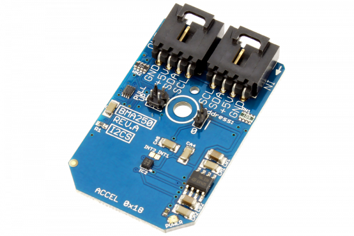

[](https://store.ncd.io/product/bma250-digital-triaxial-%C2%B12g-to-%C2%B116g-acceleration-sensor-with-intelligent-on-chip-motion-triggered-interrupt-controller-i2c-mini-module/).

# BMA250

Bosch Sensortec’s BME250 is a triaxial, low-g acceleration sensor with digital output for consumer applications. It allows measurements of acceleration in three perpendicular axes. An evaluation circuitry (ASIC) converts the output of a micro-mechanical acceleration-sensing structure (MEMS) that works according to the differential capacitance principle.
This Device is available from www.ncd.io

[SKU: BMA250]

(https://store.ncd.io/product/bma250-digital-triaxial-%C2%B12g-to-%C2%B116g-acceleration-sensor-with-intelligent-on-chip-motion-triggered-interrupt-controller-i2c-mini-module/)
This Sample code can be used with Raspberry Pi.

Hardware needed to interface BMA250 3Axis Accelometer With Raspberry Pi :

1. <a href="https://store.ncd.io/product/bma250-digital-triaxial-%C2%B12g-to-%C2%B116g-acceleration-sensor-with-intelligent-on-chip-motion-triggered-interrupt-controller-i2c-mini-module/">BMA250 3Axis Accelometer Sensor</a>

2. <a href="https://store.ncd.io/product/i2c-shield-for-raspberry-pi-3-pi2-with-outward-facing-i2c-port-terminates-over-hdmi-port/">Raspberry Pi I2C Shield</a>

3. <a href="https://store.ncd.io/product/i%C2%B2c-cable/">I2C Cable</a>

## Python

Download and install smbus library on Raspberry pi. Steps to install smbus are provided at:

https://pypi.python.org/pypi/smbus-cffi/0.5.1

Download (or git pull) the code in pi. Run the program.

```cpp
$> python BMA250.py
```
The lib is a sample library, you will need to calibrate the sensor according to your application requirement.
